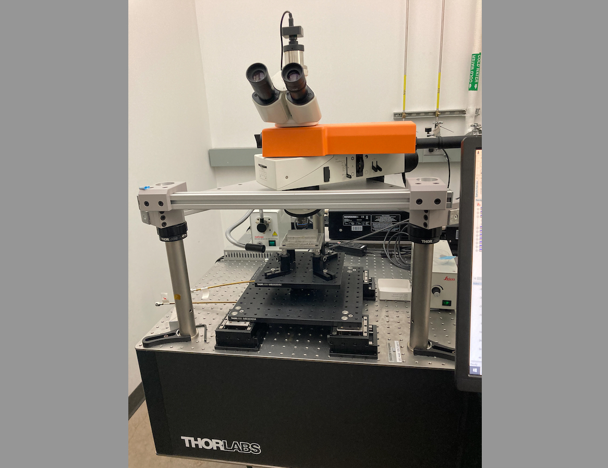
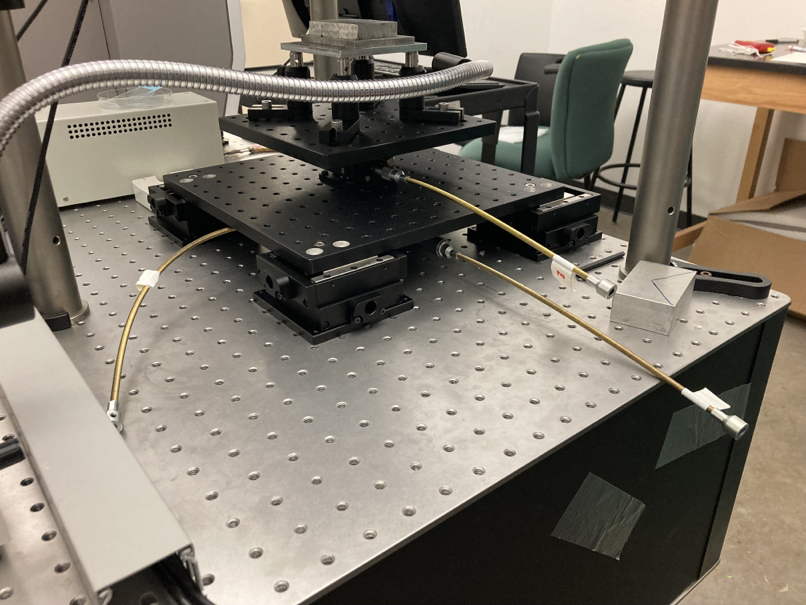
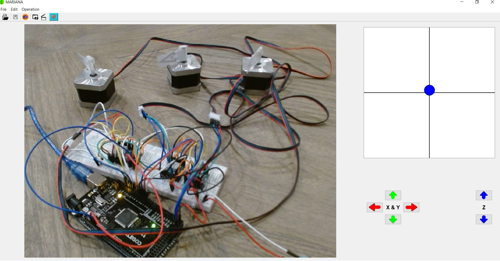

<h1>Mariana</h1>

<h3 align="center">Motorizing a Microscope under $1000 </h3>

  

# MARIANA project Source Code

This repository is based on [*raacampbell/openstage*](https://github.com/raacampbell/openstage) and  [*Turner Lab*](https://www.janelia.org/lab/turner-lab/openstage).

[comment]: #cover

Download the files as a zip using the green button, or clone the repository to your machine using Git.

## Prerequisition

- python 3 [installation](http://www.stevenpei.com/doc/InstallPython.pdf)
- PyQt 5 [installation](http://www.stevenpei.com/doc/InstallPyQt.pdf)
- telemetrix aio [installation](https://mryslab.github.io/telemetrix/)

## Download and Installation
- Download the repository az a zip file into your local computer;
- Unzip the file to any folder. Any free zipper, like 7-Zip, will do it
- Under the local root you should be able to see the following folders:
    - src
    - docs
    - examples
    * mariana.bat
    * mariana.vbs
	* README.md
    * LICENSE.txt

- Double click mariana.bat or mariana.vbs to run the program 

## User guide
- please refer user guide.

## address any issues to 
StevenPei99@gmail.com